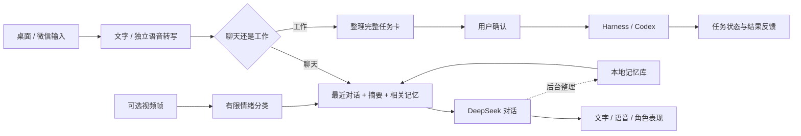

## 修改记录

[查看全部修改记录](CHANGELOG.md) · 时间：北京时间（UTC+8）

| 修改时间 | 本次修改 |
| --- | --- |
| 2026-09-21 18:46 | 修复 Mac 和 Windows 对新格式 API Key 的误拒，完整保留含点号的密钥并统一保存、读取与请求传递。 |
| 2026-09-19 19:15 | Mac版新增文字与近期对话的情绪推测，分别保存用户情绪、桌宠心情和消息快照，并提供网页查询。 |

## 预开发计划

正在规划本地模型接入：

| 功能 | 计划方案 | 状态 |
| --- | --- | --- |
| 对话 | 通过 Ollama 接入本地对话模型 | 规划中 |
| 语音合成 | 接入 GPT-SoVITS 本地语音合成 | 规划中 |
| 情绪识别 | 接入 Qwen-Omni 系列小模型，处理本地音视频情绪识别 | 规划中 |

---

<div align="center">
  
  <h1>AAAAGENT</h1>
  <p><strong><a href="https://www.bilibili.com/video/BV1cueG6sE85/">▶ 观看完整演示 · 哔哩哔哩</a></strong></p>
  <p>会聊天、记得相处，也能把想法交给工作 Agent。</p>
  <p><strong>简体中文</strong> · <a href="README.en.md">English</a></p>
  <p><a href="docs/PLATFORMS.md">Mac / Windows</a> · <a href="docs/SETUP.md">开始使用</a> · <a href="docs/MEMORY.md">记忆与上下文</a> · <a href="docs/PROMPT_REFERENCES.md">提示词与社区参考</a> · <a href="docs/LIVE2D.md">接入自己的 Live2D</a> · <a href="assets/original-design/README.md">DeepSeek 大肥鱼设计稿</a></p>
</div>

> [!IMPORTANT]
> **我们将在两天后（2026 年 9 月 19 日）发布自己的「大鲸鱼 DeepSeek」Live2D 模型。**
>
> 目前使用、视频中展示的是**量贩式购买的第三方 Live2D 模型**（[B站搜索「Live2D量贩」](https://search.bilibili.com/all?vt=35099468&amp;keyword=live2d%E9%87%8F%E8%B4%A9&amp;search_source=1&amp;from_source=web_recommend_search)）。原作者的授权不允许二次转发，因此不随本项目提供模型、纹理、表情和动作文件。
>
> 大家也可以自行选择免费且授权允许使用的 Live2D 模型，按照 [接入说明](docs/LIVE2D.md) 在本地适配，并遵守各模型的使用与分发条款。

## 视频演示

https://github.com/user-attachments/assets/f499c069-4a13-4f79-b705-ce332d7b06f2

**点击上方播放器即可观看完整演示（约 9 分 21 秒）。** 首页使用 720P 网页播放版；[哔哩哔哩观看](https://www.bilibili.com/video/BV1cueG6sE85/) · [1080P60 原画下载](https://github.com/phoiex/AAAAGENT/releases/tag/demo-video-20260917)。

---

> **禁止商用 · 使用须署名**：本项目原创内容禁止任何形式的商业用途。使用、引用、转载或改编须注明 AAAAGENT、原作者及[项目来源](https://github.com/phoiex/AAAAGENT)。完整条款见 [LICENSE](LICENSE)。

AAAAGENT 是一个以 macOS 为主要平台、同时提供 Windows 开发版的陪伴型桌面助手。你可以和它说话、用文字交流，也可以通过微信延续对话。需要完成工作时，它把需求整理成任务卡，交给你确认，再转给 DeepSeek Harness 或已有的 Codex 任务。 **[▶ 在哔哩哔哩观看完整演示](https://www.bilibili.com/video/BV1cueG6sE85/)**

需要原画文件？[下载最终演示视频（1080P60，字幕修正版）](https://github.com/phoiex/AAAAGENT/releases/tag/demo-video-20260917)。受 GitHub 单文件大小限制，视频无损分为两段，未重新编码或压缩画质。

## 平台选择与反馈

**macOS 是目前功能最完善的版本，推荐优先体验。Windows 版持续完善中，如遇问题请及时在本仓库的 Issues 中反馈，我们会在对应 Issue 中跟进处理。**

| 平台 | 状态与入口 |
| --- | --- |
| **macOS** | 当前主要维护和使用的完整版本；源码在根目录 `code/desktop-pet/`。查看 [Mac 安装说明](docs/SETUP.md)。 |
| **Windows** | 独立 Electron 开发版；源码在 `windows/code/desktop-pet/`。查看 [Windows 安装说明](windows/README-WINDOWS.md)。已有独立 Codex app-server/Harness 适配；本次更新未重验 Windows，现有 ACL 问题保留。 |

详情见 [平台差异与问题反馈](docs/PLATFORMS.md)。报告问题时请附系统版本、复现步骤和去除敏感信息的报错。两个目录分别安装依赖，勿混用配置或构建产物。

陪伴和工作共享一个入口，但不把所有工程记录塞进陪伴记忆。最近的对话负责衔接，长期记忆负责回想，项目索引负责找到对应的工作上下文。

**本仓库是源码发布包。** API 凭据、个人对话和记忆、微信登录状态、音色克隆资料、唤醒模型权重、第三方 Live2D 模型与 Cubism SDK 均不随包发布。上方图片是项目制作的同人设计稿，Live2D 绑定仍在制作中。

新增：在管理页 **记忆 → 导入旧聊天** 整理指定本地历史，支持暂停、跨副本去重与遗忘保护。开始前请查看模型和费用配置，详见[使用说明](docs/MEMORY.md#导入旧聊天)。

## 可以做什么

本次独立情绪状态、消息快照和情绪页面已更新至 Mac 源码；Windows 尚待移植与验证，本次保留其现有源码。

以下以 macOS 版的主要能力为参考；Windows 版的可用范围见上方平台说明。

| 能力 | 使用方式 |
| --- | --- |
| 语音聊天 | 按键发言、查看实时音量反馈；新的输入可打断当前回复。转写与文字对话分别调用服务。 |
| 本地唤醒 | 开启后使用本地关键词检测；唤醒后进入正常录音，去掉唤醒词，按静音时长结束。需另行配置本地权重。 |
| 情绪相关的回应 | 从文字与近期对话推测情绪，结合有效音视频观察，分别保存用户情绪与桌宠心情；网页可查消息快照及来源，未知强度留空。 |
| 语音与角色表现 | TTS 播放与口型联动；有思考、工作、交互等表现逻辑，具体动作取决于接入模型的参数与预设。 |
| 微信聊天与任务 | 支持文字与语音输入；可配置文字回复或音频文件回复。原生微信语音条尚不作为可靠输出方式。 |
| 工作转交 | 小型检索、整理可交给 Harness；规划、架构与工程任务可交给 Codex。指定执行者时保留你的选择，发送前确认。 |
| 网页管理 | 查看和修改角色 Prompt、记忆、召回记录、上下文设置、语音配置、表现预设及连接状态。 |

日常对话不应为了“现在几点”之类的问题创建工程任务。工作流也保留语音补充、确认和取消入口；“查询任务进度”默认看最近安排的任务，明确说“所有任务”才展开全部。

## 人格提示词与社区参考

**拟人化优化提示词尚未完成。** 欢迎按自己的聊天习惯调整角色设定。

如果你希望调整说话风格、角色性格或情绪回应，可以按需查阅、搜索社区方案，在网页管理页的 **记忆与对话 → 角色设定 Prompt** 中自行调整并试聊。我们整理了 [提示词参考与致谢](docs/PROMPT_REFERENCES.md)，包括 MaiBot、SillyTavern、ChatHaruhi、Hume、Alice_methodology，以及 **[AI-Vtuber](https://github.com/Ikaros-521/AI-Vtuber)** 和 **[Open-LLM-VTuber](https://github.com/Open-LLM-VTuber/Open-LLM-VTuber)**。感谢原作者与贡献者的公开分享，文档中附有各项目的原始链接。

## 它怎样工作



DeepSeek 负责文字对话及相关结构化处理；独立 ASR 负责忠实转写，Qwen 多模态适配器负责图像理解，MiniMax 适配器负责 TTS。模型和服务凭据由使用者配置。项目复用已有的 Harness 服务和 Codex 连接能力，不内置另一套大型 Agent 平台。

## 记忆的核心设计

1. **先接住刚才的话。** 在输入预算内优先装入连续、完整的最近几轮，再补摘要和相关长期记忆。
2. **长期整理放后台。** 保存对话后异步处理记忆；普通整理失败不应阻断后续对话。涉及遗忘、纠正的请求另有隐私保护边界。
3. **情绪保留来源与当时状态。** 每条消息冻结本轮观察及彼时用户情绪、桌宠心情；最近对话和相关记忆优先，情绪提供辅助背景。在 **记忆 → 当前情绪** 查看，原长期记忆公式保持。
4. **工程细节按需读。** 项目索引只存名称、简短摘要和详情引用；完整任务内容、回执和执行记录不常驻陪伴上下文。
5. **用户可以管理。** 可查看来源、修改记录、调节部分召回参数、查看实际召回和处理失败的项目。

公式、数据流、失败处理和代码入口见 [记忆与上下文](docs/MEMORY.md)。当前检索以关键词和短语匹配为主。

## 开始使用

**自助配置：** 编译后运行 `npm run configure-local`（Windows 用 `npm.cmd`），即可填写 DeepSeek/百炼 Key、选择已适配模型、上传自己的参考音频。使用前需在百炼开通对应模型并配置 Key。Harness 与 Codex 必须另装、启动并完成登录或配置，缺失时不能向其转发任务。详见[安装与配置](docs/SETUP.md)。

Mac 用户先阅读 [安装与配置](docs/SETUP.md)；Windows 用户请直接阅读 [Windows 安装说明](windows/README-WINDOWS.md)。下面命令针对根目录的 Mac 源码。这是需要本地配置的开发者版本，完整桌宠还需要你自行准备合法授权的 Live2D 模型及 SDK。

```sh
cd code/desktop-pet
npm ci
npm run build
```

这一步编译源码，不会自动登录微信、调用模型或启动麦克风。桌面启动、服务配置和缺失资源检查的具体步骤以安装文档为准。

| 想接入的部分 | 需要自行准备 |
| --- | --- |
| 文字对话 | DeepSeek 或代码中受支持的服务配置及凭据 |
| 语音转写 / 图像理解 | 对应 ASR、多模态服务权限及 API 配置 |
| 语音输出 | MiniMax 配置及你有权使用的音色；本仓库不带私人克隆音色 |
| Live2D | 授权模型、Cubism SDK、参数映射和自己的表现预设 |
| 本地唤醒 | 适配的关键词检测模型与本地配置 |
| 工作 Agent | 本机 Harness / Codex 服务，以及需要转交的项目和任务 |
| 微信 | 使用者自己的账号登录与绑定 |

## Live2D 与角色设计

**支持接入不同的 Cubism Live2D 模型，但需要本地适配。** 不同模型的参数 ID、表情文件、动作范围和物理设置不同，不能只替换一张图片或复制一个文件就获得全部动作。查看 [Live2D 接入说明](docs/LIVE2D.md)。

当前提供的 [DeepSeek 大肥鱼设计稿与基础资源](assets/original-design/README.md) 包含静态美术与拆层资源，Live2D 绑定仍在制作中。

## 目录

```text
README.md / README.en.md   中英文项目首页
code/desktop-pet/          macOS 主版本源码
windows/                  Windows 独立开发版、启动入口与验证说明
tools/                    发布检查与配置辅助工具
docs/                     安装、记忆、模型接入说明
assets/original-design/   项目制作的鲸鱼娘同人设计与基础素材
```

## 隐私、发布与当前边界

- 本地保存对话、记忆、项目索引和配置；调用云服务时，会把所需的文本、音频或图像发送给所选供应商，
- 只应提交这个干净发布目录。不要复制私人运行目录、数据库、登录凭据、带令牌的链接、服务器配置或含聊天内容的日志。
- 唤醒默认不开启；本地检测不产生持续的云端识别请求。唤醒后的 ASR、对话、TTS 仍可能计费。
- macOS 是目前最完善的版本；Windows 发布包附有移植作者的验证记录，本次发布未重新进行 Windows 真机验收。Linux 桌面版未验证。手机实际显示、音色效果及新模型动作需在自己的设备验证。
- 本项目原创内容采用[非商业使用及署名许可](LICENSE)：**禁止任何形式的商业用途，使用或引用须注明项目、作者与来源链接**。第三方依赖、SDK 和角色素材保留各自条款，见 [角色资源说明](assets/original-design/README.md) 及源码中的第三方声明。

欢迎用不含私人数据的最小复现描述问题。不要在公开 Issue 中粘贴真实凭据、完整对话库或登录二维码。

## 引用与署名

使用本项目制作应用、演示、视频、文章或论文时，请保留版权说明，并在说明或引用处标注：

> AAAAGENT — phoiex 及项目贡献者。https://github.com/phoiex/AAAAGENT （注明使用版本或提交、访问日期）

可使用 GitHub 的 “Cite this repository” 入口获取引用信息。修改或二次分发须说明修改，保留许可；第三方素材仍须分别署名。
